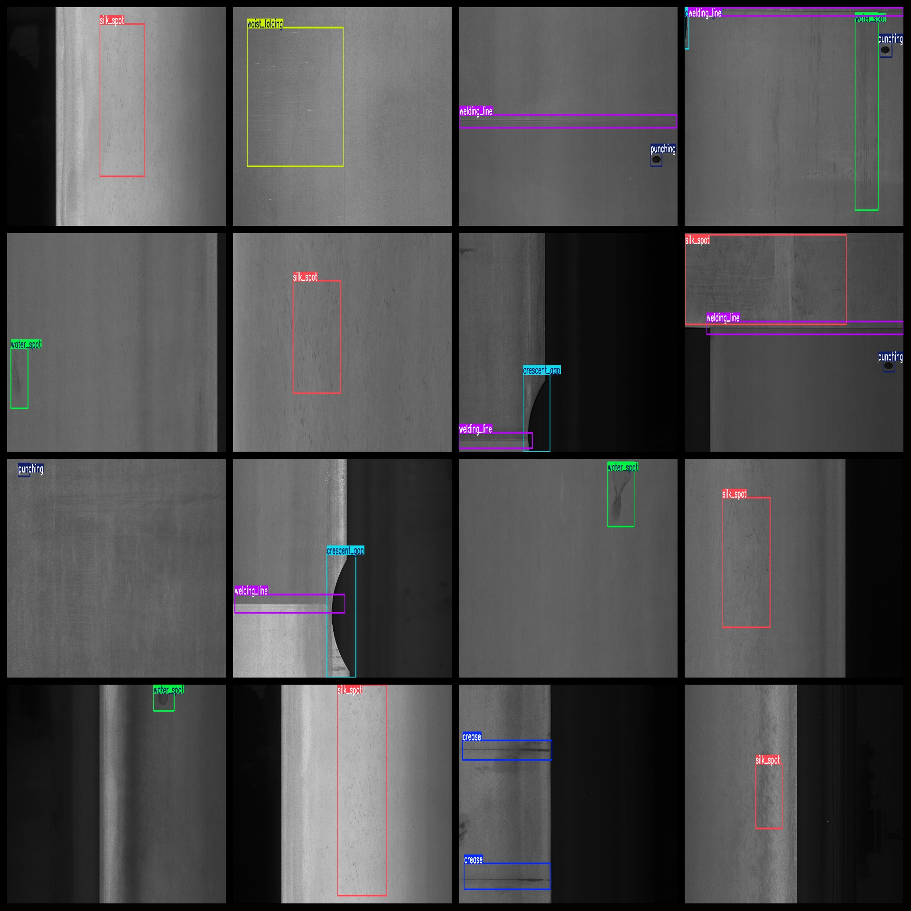
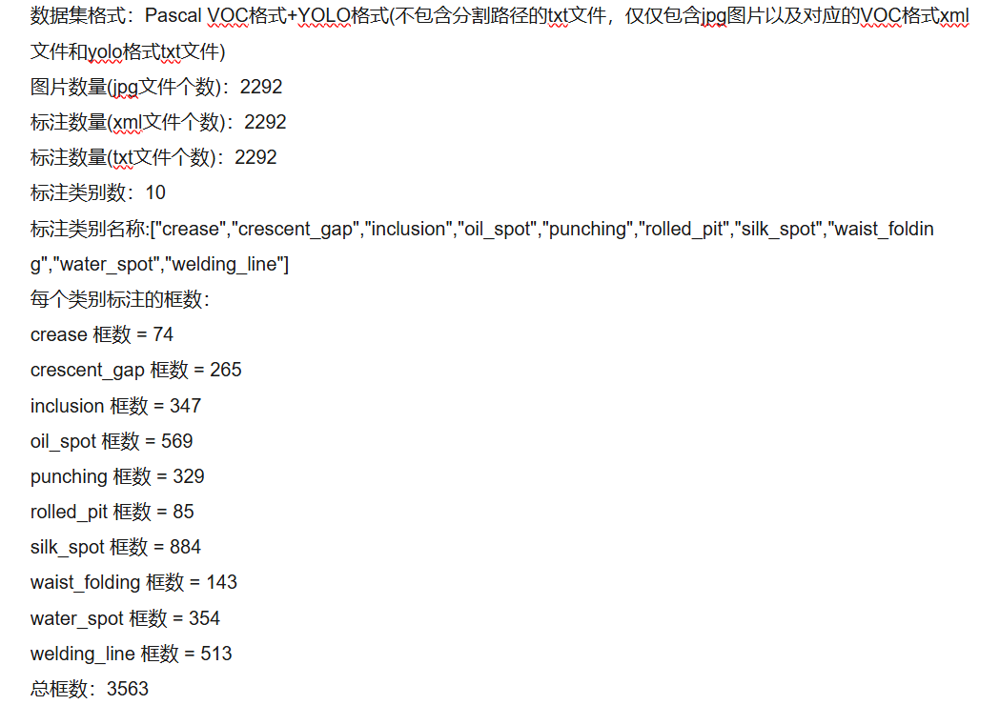

# [Object Detection] Welding PCS Surface Defect Detection Dataset VOC+YOLO format2292 images10-class

Dataset Description: ~

Dataset format: Pascal VOC format + YOLO format (the txt file does not contain the split path, it only contains jpg images and corresponding VOC format xml files and yolo format txt files)

Number of images (number of jpg files): 2292

Number of annotations (number of xml files): 2292

Number of annotations (number of txt files): 2292

Number of categories: 10

Annotation class names: ["crease","crescentgap","inclusion","oilspot","punching","rolled_pit","silk_spot","waist_folding","water_spot","welding_line"]

Number of boxes labeled in each category:

crease frame count = 74

crescent_gap frame count = 265

inclusion frame count = 347

oil_spot frame count = 569

punching frame count = 329

rolled_pit frame count = 85

silk_spot frame count = 884

waist_folding frame count = 143

water_spot frame count = 354

welding_line frame count = 513

Total boxes: 3563

## Images

---

Here is a pay link on Stripe (https://buy.stripe.com/3cs8yP7sY87d0vu9AB). Please contact me lonlonago@foxmail.com after funding $89, and I will send you a complete data files, thank you!

